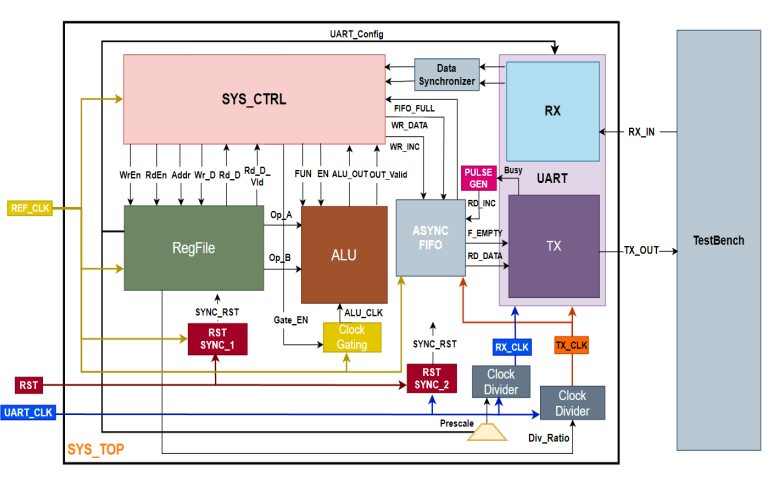
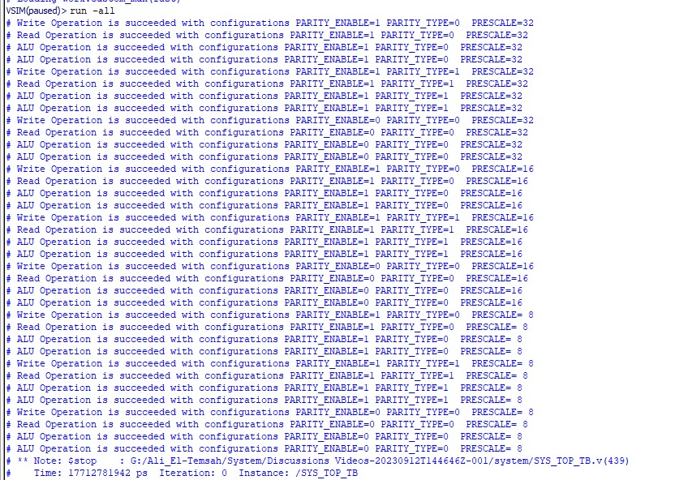
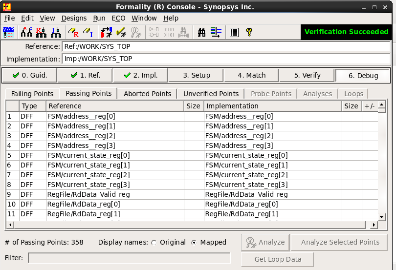
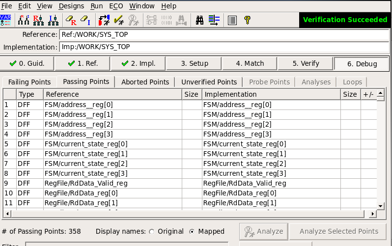
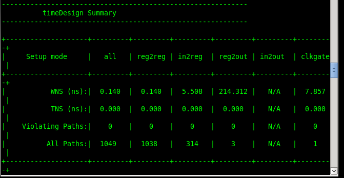
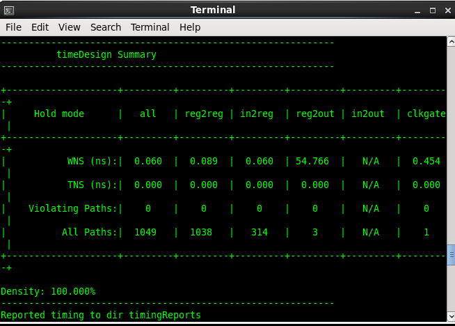
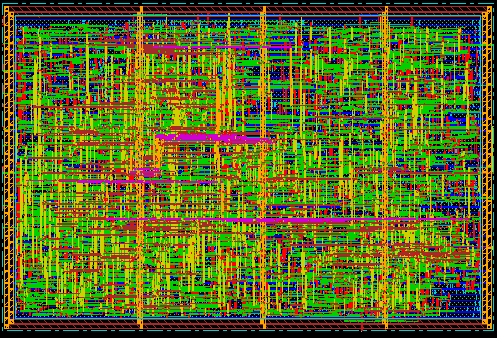
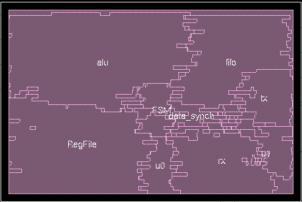

# Low_Power_Configurable_Multi_Clock_Digital_System
RTL to GDS Implementation of Low_Power_Configurable_Multi_Clock_Digital_System which is responsible for receiving commands through UART receiver to do different system functions such as register file reading/writing or doing some processing using ALU block and send results as well as asynchronous FIFO to avoid data loss in different domains through UART transmitter communication protocol.

## Block Diagram 
 *System Hierarchy*

## Simulation Results
 *System simulation *

## Formality post synthesis 
 *syn_fm*

## Formality post DFT 
 *post_dft_fm*

## P&R Timing post route setup/hold 
 *post_route_setup_analysis*
 *post_route_hold_analysis*

## P&R Layout 
 *System Layout*
 *System Layout2*
